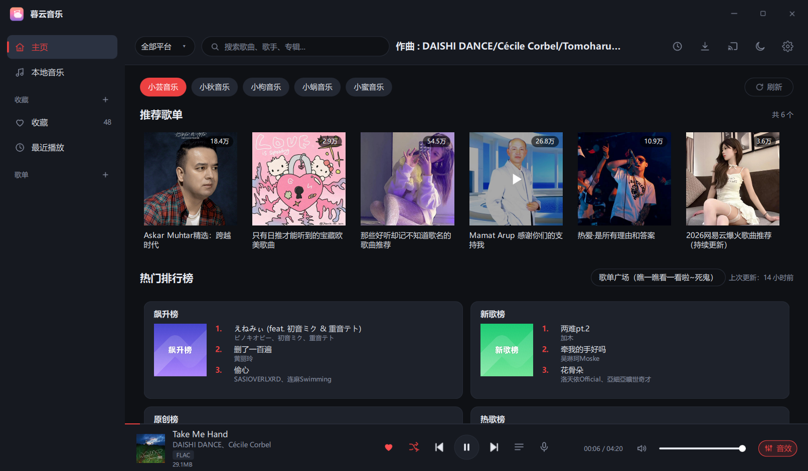
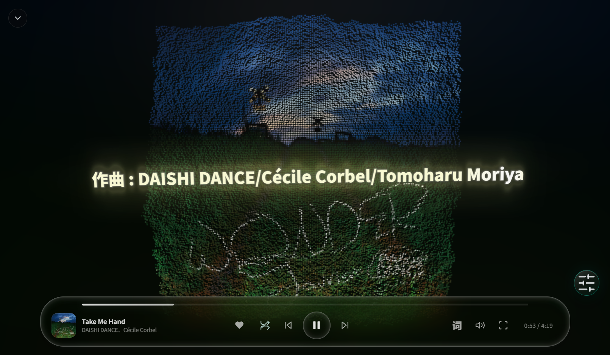
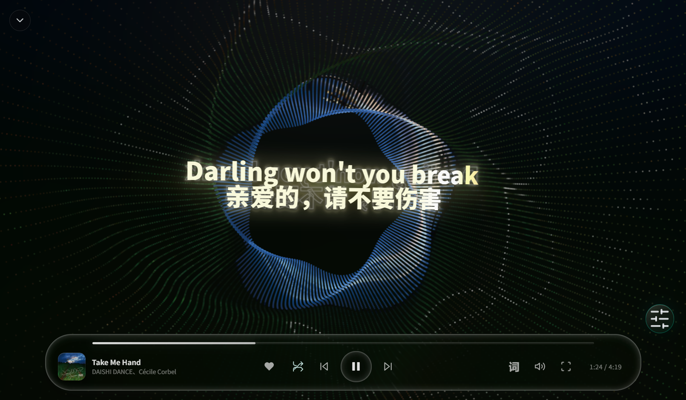
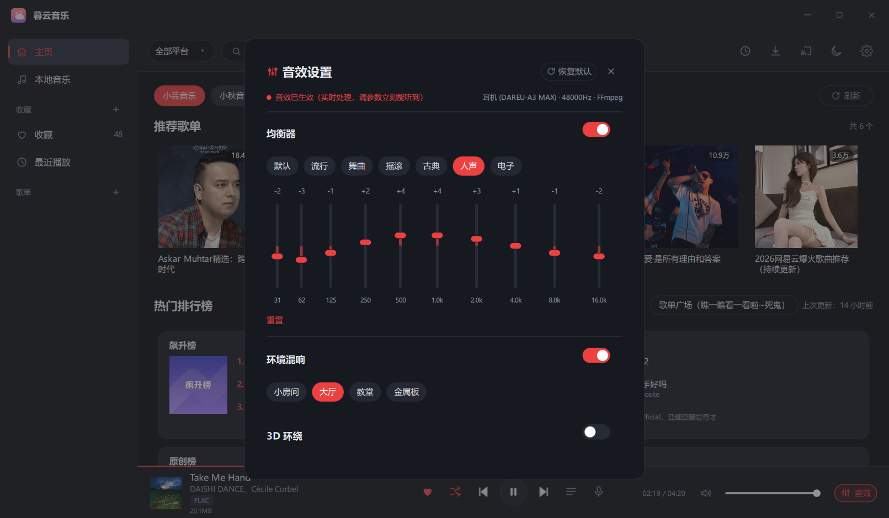
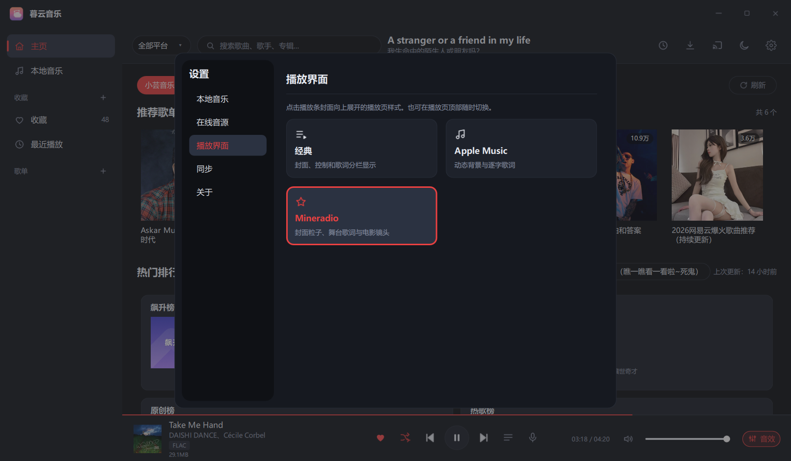
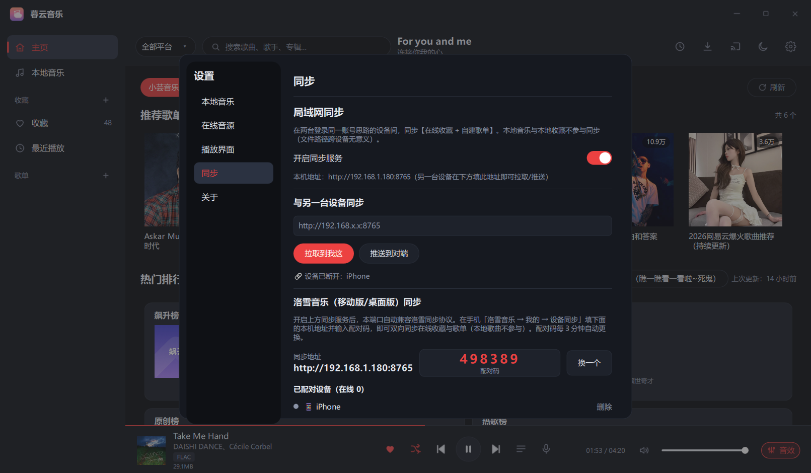

# 暮云音乐 MuyunMusic

**基于 Qt 6 / QML 的 Windows 桌面音乐播放器**：多平台音乐搜索、榜单与歌单广场，逐字歌词 / 桌面歌词 /
三种全屏播放页（含 Mineradio 舞台），全格式音效管线（均衡器 · 环境混响 · 3D 环绕 · 响度均衡），
兼容洛雪（LX Music）音源脚本与手机端同步协议。

A Qt 6 / QML desktop music player for Windows — multi-platform search & playlists, word-by-word lyrics,
full-format audio effects (EQ / reverb / 3D surround / loudness), LX Music script compatible, LAN sync.

> ⚠ **本程序不内置任何音乐播放/下载源**。内置的五个平台适配只做**搜索、榜单、封面、歌词、歌单广场**；
> 实际播放与下载 100% 依赖**你自己导入的 LX 音源脚本**（设置 → 在线音源 → 导入）。
> 请自行确认所在地法律与平台条款，仅用于学习与个人使用。

**当前版本：v1.1.6** ｜ [下载](#下载) ｜ [从源码构建](#从源码构建) ｜ [许可](#许可) ｜
[免责声明](#免责声明)

---

## 界面预览

| 主页 | 全屏歌词 · 封面模式 | 全屏歌词 · 滚筒模式 |
|---|---|---|
|  |  |  |

| 音效控制 | 播放界面选择 | 局域网同步 |
|---|---|---|
|  |  |  |

---

## 功能

### 播放与队列

- 播放 / 暂停 / 上一首 / 下一首 / 进度拖拽 / 音量 / 静音，四种播放模式（顺序、列表循环、单曲循环、随机——
  随机**一轮内不重复**，播完一轮自动重洗）
- 底部播放条：歌曲信息 / 当前行歌词（顶栏同步显示，点击可重载）/ 音质与文件大小（启动即预取）
- 播放队列抽屉、下一首播放、失败自动跳过、设备切换续播
- 在线音频缓存（key = 歌曲身份 + 音质），启动自动清理 3 天前缓存

### 歌词

- 逐字歌词、翻译 / 罗马音合并显示、全屏播放页三种样式（经典 / Apple Music 风 / Mineradio 舞台）
- 独立桌面歌词窗：工具条 + 设置窗，字号与高度自适应；置顶态悬停只保留「取消置顶」入口

### 音效（全格式）

- 10 段均衡器、环境混响（小房间 / 金属板 / 大厅 / 教堂四预设）、3D 环绕（等功率声像摆动）、响度均衡
- MP3 走 minimp3（时长样本级精确），其余格式（FLAC / M4A / OGG / OPUS / WAV …）走 Qt 自带的 FFmpeg
- 管道：后台解码 → DSP（源采样率）→ 重采样 → 环形缓冲，主线程只做 memcpy；参数调整即时生效不重解码

### 音乐库

- 本地音乐扫描、标签读写、时长精确校准（MP3 帧头遍历 / OGG granule position）
- 收藏、自建歌单、最近播放；收藏页与自建歌单支持批量（全选 / 批量下载 / 批量移除）
- 收藏在线歌单（整单进侧栏）、按歌曲换源

### 多平台与网络

- 搜索 + 联想（跨平台聚合）、榜单、推荐歌单、歌单广场（分类 + 分页，带列表缓存与并行预热）
- LX 音源脚本按官方协议实现 `globalThis.lx` 全套宿主 API：`request`（含取消函数）、`utils.buffer`、
  `utils.crypto`（`md5` / `aesEncrypt` / `randomBytes` / `rsaEncrypt`）、`utils.zlib`、
  `currentScriptInfo`、`setTimeout` / `clearTimeout`；播放取链接、歌词（`lyric`）、封面（`pic`）三个 action
  都会派发，并按 `inited.sources` 声明的音质跳过不支持的档位
- 局域网同步：暮云 ↔ 暮云，并兼容洛雪移动版协议（配对码 / AES+RSA 握手 / WS / 三方合并）

### 其它

- 无边框窗口（原生边缘缩放、最大化 / 全屏 / ESC 阶梯：舞台沉浸 → 全屏播放页 → 窗口全屏 →
  退出最大化 → 关闭主窗口，弹层在场时让位给弹层；最大化会补 `WS_MAXIMIZE` 状态位，
  TranslucentTB 一类任务栏美化 / 透明工具能正常识别）、深浅色主题、系统托盘
- 单实例守护：重复启动唤起已有窗口；权限不一致（管理员 ↔ 普通）时也**不双开**，会明确提示
- 启动静默检查更新（GitHub 版本清单，每次启动查一次；支持"稍后（本会话不再提醒）"与"不再提醒此版本"）

> 说明：**音源脚本只支持新版 `globalThis.lx` 格式**。旧版 `userApi` / `registerSource` 不支持，
> 导入时会明确提示——这是刻意的取舍，不是缺陷。

## 下载

到 [Releases](https://github.com/MyunU/Muyun-Music-Desktop/releases) 下载：

- `MuyunMusic-<版本>.exe` —— 安装版（Windows 10/11 x64，无需另装 Qt）
- `MuyunMusic-<版本>.zip` —— 便携版（解压后直接运行 `MuyunMusic.exe`）

> 从旧版升级：直接运行新版安装包即可——安装器会先自动关闭正在运行的暮云音乐（含托盘里的实例），再覆盖安装。

## 从源码构建

### 依赖

| 需要 | 版本 | 说明 |
|---|---|---|
| Qt | 6.8.3 MinGW 64-bit | 需含 Core / Gui / Qml / Quick / QuickControls2 / Network / Multimedia / Concurrent / Sql / Svg / Widgets |
| MinGW GCC | 13.1（Qt 自带 `Tools/mingw1310_64`） | 其它版本（如 GCC 16）编译会段错误 |
| CMake | ≥ 3.20 | 生成器用 `MinGW Makefiles` |

### 步骤

```powershell
# 1) 拉取舞台（MuyunStage）需要的一次性第三方文件：WebView2 SDK 头 + Loader DLL、three.js、gsap
pwsh -File stage\sdk\fetch-sdk.ps1

# 2) 配置 + 编译（把 <Qt> 换成你的 Qt 路径）
cmake -S . -B build -G "MinGW Makefiles" `
      -DCMAKE_PREFIX_PATH="E:/Qt/6.8.3/6.8.3/mingw_64" `
      -DCMAKE_C_COMPILER="E:/Qt/Tools/Tools/mingw1310_64/bin/gcc.exe" `
      -DCMAKE_CXX_COMPILER="E:/Qt/Tools/Tools/mingw1310_64/bin/g++.exe"
cmake --build build --target MuyunMusic --parallel 4
```

产物在 `build/MuyunMusic.exe`（依赖由 `windeployqt` 自动部署到同目录）。

### 开关

- `-DMUYUN_CONSOLE=ON`：编译成控制台程序（跑 `--test-*` 自检、看运行日志用）
- `-DMUYUN_SELFTES=OFF -DCMAKE_BUILD_TYPE=Release -DCMAKE_EXE_LINKER_FLAGS=-s`：发布构建
  （编译级剔除全部自检与调试输出，体积 4.9MB → 3.3MB）
- `-DMUYUN_STAGE=OFF`：不编译舞台（纯 Win32 + WebView2 的独立进程 `MuyunStage.exe`）

### 打包（可选）

`package/build_payload.ps1` 出便携 zip、`package/build_installer.ps1` 出安装包
（需 .NET Framework 4 的 `csc.exe`）。

## 数据目录

运行数据统一在 `%USERPROFILE%\.muyun`：`store/`（收藏、设置、队列）、`lx-sources/`（导入的音源脚本）、
`lx-sync/`（配对与列表快照）、`cache/`（封面缓存）。同机所有实例共用这一份（便携版与安装版也共用）。

## 自检

开发版（`-DMUYUN_SELFTES=ON`）内置 50 个 `--test-*` 端到端自检（覆盖 DSP、音效管线真实出声、歌词配对、
LX 协议一致性、ESC 阶梯、输入法守护、单实例、更新提示、批量操作、桌面歌词置顶真点击等），例如：

```powershell
$env:MUYUN_STORE_ROOT = "$env:TEMP\muyun-test"   # 隔离数据目录（会写数据的自检必须设，否则拒绝运行）
MuyunMusic.exe --test-dsp              # DSP 波形：EQ / 混响 / 环绕 / 响度均衡
MuyunMusic.exe --test-effects-live     # 音效管线真实出声
MuyunMusic.exe --test-lyric-merge      # 歌词译文配对
MuyunMusic.exe --test-update           # 更新提示（离线，可用 MUYUN_UPDATE_LIVE_URL 验真网络）
MuyunMusic.exe --test-lxsource         # LX 音源脚本协议一致性（逐条断言，全离线）
MuyunMusic.exe --test-esc-ladder       # ESC 阶梯（含退最大化 / 关主窗口 / 弹层让位）
MuyunMusic.exe --test-ime              # 输入法上下文守护（任何焦点下都能切中英文）
MuyunMusic.exe --test-single-instance  # 单实例守护（第二个实例不双开、能唤起主窗）
```

## 许可

- **主程序：MIT**，见 [LICENSE](LICENSE)。
- **`stage/`（Mineradio 舞台内核）: GPL-3.0**。它以**独立进程** `MuyunStage.exe` 与主程序松耦合聚合，
  因此主程序仍按 MIT 分发；再分发时请保留 `stage/web/README.md`、`stage/web/mineradio/README.md`、
  `stage/web/mineradio/music-tempo.LICENCE` 等许可声明。
- 第三方组件与完整许可清单见 [THIRD-PARTY.md](THIRD-PARTY.md)
  （Qt / FFmpeg / minimp3 / QuickJS / WebView2 SDK / three.js / GSAP / music-tempo 等）。

## 致谢

- [Sollin-Music-Desktop](https://github.com/Ryderwe/Sollin-Music-Desktop)（MIT）
- [lx-music-desktop](https://github.com/lyswhut/lx-music-desktop) /
  [lx-music-mobile](https://github.com/lyswhut/lx-music-mobile)（Apache-2.0）
- [Mineradio](https://github.com/XxHuberrr/Mineradio)（GPL-3.0）

## 免责声明

**本项目是播放器，不是音乐服务。** 它没有服务器，仓库里也没有任何音频文件——你听到的音乐，
全部来自你自己的操作。

### 音源由你导入

内置的平台适配只做**搜索、榜单、封面、歌词、歌单广场**，不返回任何可播放或可下载的音频；
本项目**不具备获取音频数据的能力**。

实际播放与下载 100% 依赖你自行导入的第三方解析脚本（设置 → 在线音源 → 导入）。本项目做的只是把
歌曲名、歌手等信息交给脚本，脚本返回什么链接，本项目就当作该曲音频去播放。**是不是正确的音频，
本项目无法校验**——因此可能出现想听的不一致、或放不出来，由你自行判断。

各平台数据来自公开可访问的接口（相当于未登录状态下在官方应用里能看到的内容），经简单筛选与合并后
展示。本项目**不对这些数据的合法性、准确性、完整性负责**。

「我的列表」等本地数据来自你的机器或你自己配置的同步服务，同样不在本项目责任范围内。

### 缓存只落在你本机

播放与下载产生的音频、封面，**只写在你自己的机器上**——数据目录下的 `cache`、系统临时目录、
程序目录内的舞台封面缓存，共三处；设置 → 关于 →「清除缓存」可一次清掉。

**本项目不存储、不分发、不传播任何音乐内容**，无从知道你在本地留下了什么，也无法替你删除。

音频与封面属于第三方持有版权的数据，**请在 24 小时内清除**。本项目不拥有、也不主张这些数据的
任何权利。

### 平台称呼

代码内对平台使用了别称。**它们只是技术标识，不含任何恶意**；如相关方认为不妥，提一个 Issue，
我们会改掉。

### 第三方资源

部分字体、图标与素材取自互联网开源项目，许可证见 [THIRD-PARTY.md](THIRD-PARTY.md)。
发现侵权请提 Issue，我们移除。

### 使用限制

本项目完全免费、开源发布于 GitHub，**仅用于技术探索与个人学习研究**；不保证其技术在任何法域下的
合法性。**请在合法的前提下使用**，违法违规使用造成的后果由你自行承担。

音乐平台不易——尊重版权，支持正版。

### 责任限制

因使用本项目（或无法使用本项目）产生的任何直接或间接损害——数据丢失、故障、中断、损失等——
**由使用者本人承担**；本项目不承担由此造成的任何直接、间接、特殊、偶然或结果性责任。

本项目为个人开源项目，不接受任何商业合作（广告、付费解锁、会员、售卖音源或音乐内容）。

### 接受

使用本项目即表示你已阅读并接受以上全部条款。

项目许可：主程序 [MIT](LICENSE)，`stage/` 舞台内核 GPL-3.0（见 LICENSE 尾部说明）。本节与
许可证冲突时，以本节约束为准。

异议请提 Issue：<https://github.com/MyunU/Muyun-Music-Desktop/issues>
